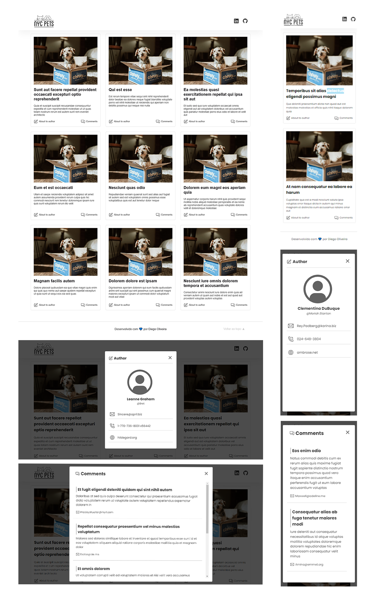

#  Teste Criptonomia - Front-End

## ℹ️ Sobre o projeto

A equipe recebeu uma demanda para desenvolver um front-end para uma API RESTful. No
cenário proposto, a interface deve exibir posts de um blog e, ao clicar em um post, os
comentários associados.

## ✨ demonstração

</br>



</br>
Você pode conferir o resultado final em: https://teste-front-end-criptonomia.vercel.app/

## 🎯 Objetivo do projeto

O projeto faz parte do processo seletivo da Criptonomia para o cargo de Desenvolvedor Front-End

Os seguintes itens serão analisados como avaliação técnica da demanda:

1. Funcionamento da solução.
2. Organização do código (tipos de projetos, diretórios, nome dos arquivos, etc...).
3. Organização do repositório no GitHub.
4. Coerência com a tarefa proposta.
5. Usabilidade.
6. Responsividade.
7. Uso de tecnologias/frameworks de mercado.

## 📝 Tecnologias

Para a realização desse projeto foi utilizado as seguintes tecnologias/linguagens:

- [ReactJS](https://pt-br.reactjs.org) para criação da interface
- [Styled-components](https://styled-components.com/) para estilização com o css

## ⚙️ Instalação

Para que este rode em sua máquina, siga os passos abaixo:

```bash
# Clone o repositório em alguma pasta em sua máquina
$ git clone https://github.com/Diegooliveyra/Teste-Front-end-criptonomia.git

# Entre no repositório
$ cd Teste-Front-end-criptonomia

Instale as dependencias digitando no termimal:
$ yarn install

Rode a aplicação no modo de desenvolvimento.
$ yarn start

Abra http://localhost:3000 no seu navegador para visualizar o projeto
```

## 📝 Licença

<p>O projeto se encontra sob licença MIT. Para mais detalhes, acesse <a href='LICENSE'>license<a>.</p>
<p>Criado com 💙 por <a href='https://github.com/Diegooliveyra/' target='blank'>Diego Oliveira</a></p>
